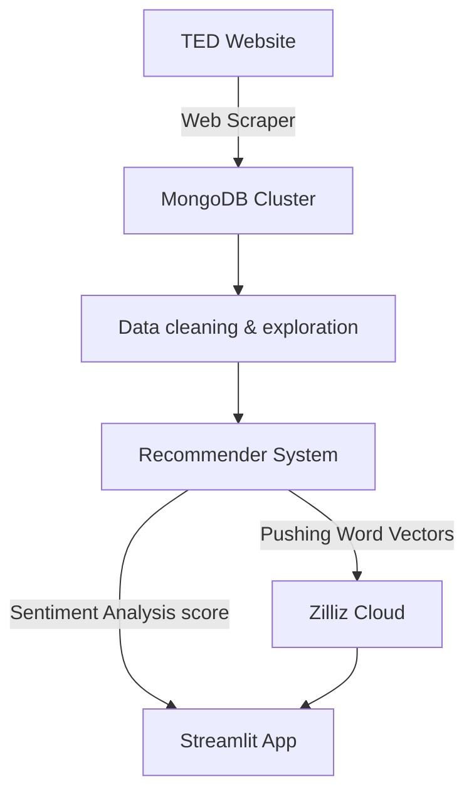

# September-2023-Group-001
This is the Group 001 repository for the WaiPRACTICE September cohort.

## TED Talks NLP Recommender System

### Overview
This project aims to build a recommender system for TED Talks using Natural Language Processing (NLP). The system recommends TED Talks based on the content and metadata of the talks. Some of the main features of this project are:
- A custom-built web scraper that collects data from the official TED Talks website.
- A MongoDB cluster that stores the raw data in a scalable and flexible way.
- Jupyter notebooks that transforms the data into a tabular format for NLP tasks, conduct exploratory data analysis, and applied NLP techniques of text modelling.
- A hybrid recommender system that uses sentiment analysis and cosine similarity to rank the talks.
- A streamlit app that connects to zilliz cloud to provide a user-friendly interface for the recommender system.

Please check out the [github page of the project](https://women-in-ai-ireland.github.io/September-2023-Group-001/) for more information about the context, dataset, methodology, findings and future works.

### Data Collection - TED Web Scraper
The data for this project is obtained using a custom-built web scraper (`TED_scraper` found in `DataCollection`). The scraper is built using the Python `requests` library and is designed to scrape data from the official TED Talks website. The scraped data includes details about each talk such as the title, speaker, transcript, and more.

### Data Storage
The raw data scraped from the website is stored in a MongoDB cluster. MongoDB was chosen for its ability to store large amounts of unstructured data, which is ideal for our web scraping needs. An user with read only access is provided to access the data.

### Data Transformation
A Jupyter notebook is used to flatten all JSON files from each talk. This transforms the data into a tabular format which is easier to work with for our NLP tasks. The transformed data includes one row for each talk and columns for each piece of information about the talk (see `Wrangling` notebook).

### Recommender - NLP analysis and modelling
The recommender system uses sentiment analysis and cosine similarity to find talks that match the user’s preferences and interests. 
- Sentiment analysis is a technique that assigns a polarity score to a text, such as positive, negative, or neutral. The recommender system applies sentiment analysis to the transcriptsof the talks and then compares the sentiment scores of the talks across the whole corpus.
- Cosine similarity is a measure that calculates the angle between two vectors, such as the TF-IDF vectors of two texts.  The system also applies cosine similarity to the transcripts and metadata of the talks, which capture the content and topic of the talks. The system then compares the cosine similarity scores of the talks with the user’s query, which also reflects the user’s interest.

The recommender system then combines the sentiment analysis and cosine similarity scores to rank the talks and recommend the most relevant ones to the user.

To make the recommender system more accessible and interactive, we built a streamlit app, called [TED talks Recommender](https://ted-recommender-app.streamlit.app/), where the user can test & get recommendations of TED talks. Streamlit is a framework that allows you to create web applications for data science and machine learning projects with minimal code. The vectors used for the recommender system are store on Zilliz cloud, which is a fully-managed vector database service that enables fast and scalable vector search.

### Project graph

### Acknowledgements
We would like to thank our mentor (Jennifer) and team from WaiPRACTICE (Luciana, Meghana, Nabanita) for providing the feedback and support for this project.
