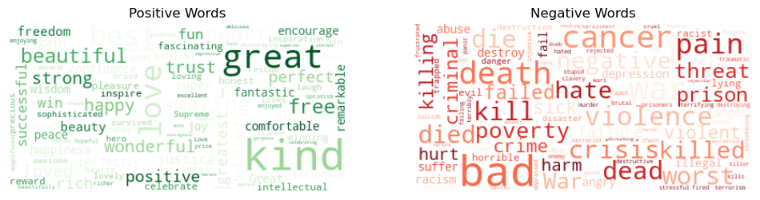

# (Content based) Recommender System using TED talks
   
## Background

### A. Why NLP recommendation system?

Recommender systems are algorithms that suggest relevant items to users based on their preferences, needs, and behavior. Recommender systems have become ubiquitous in various domains, such as e-commerce, entertainment, education, and social media, where they help users discover new and interesting products, services, or content. Recommender systems can also benefit businesses by increasing customer satisfaction, loyalty, and revenue.

Natural language processing (NLP) is a branch of artificial intelligence that deals with the analysis and generation of natural language. NLP can enable recommender systems to leverage textual information about the items and the users, such as descriptions, reviews, profiles, etc. NLP can also help recommender systems to understand the user's queries, feedback, and intents, and to provide natural and engaging responses.

Recommender systems using **NLP** can offer several advantages over traditional recommender systems, such as:

- They can handle complex and diverse items, such as books, articles, movies, etc., that have rich textual content and require semantic understanding.
- They can provide more accurate and personalized recommendations by capturing the user's preferences, needs, and interests from their natural language interactions.
- They can overcome the data sparsity and cold start problems by using NLP techniques to extract features and similarities from the text data.
- They can enhance the user experience and engagement by providing natural language explanations, summaries, and dialogues for the recommendations.

### B. Why TED?

**TED** (Technology, Entertainment, Design) is a global platform that showcases *ideas worth spreading*. **TED Talks** are short, powerful presentations that cover a wide range of topics, from science to art, from business to education, and from personal stories to global issues. TED Talks are delivered by experts, innovators, leaders, and storytellers who aim to inspire, educate, and challenge the audience.

The TED Talks website contains over 6,000 talks in more than 100 languages, with new talks added every week. The website also allows users to browse talks by categories, themes, ratings, and tags. However, with such a large and diverse collection of talks, it can be difficult for users to find the talks that match their interests and preferences. 

Therefore, the main motivation for this project is to build a recommender system for TED Talks that can help users discover new and relevant talks based on the content of the talks. The recommender system uses natural language processing techniques to analyze the transcripts and metadata of the talks, and to generate recommendations based on the sentiment, topic and similarity between talks. 

## Methodology

The methodology of this project consists of the following steps:

**Data Collection** 
 We use a custom-built web scraper to scrape data from the official TED Talks website. The scraper collects information about each talk, such as the title, speaker, transcript, tags, ratings, etc. The scraper is built using the Python `requests` library and can handle pagination, API throttling, and error handling.

**Data Storage** 
The raw data scraped from the website is stored in a MongoDB cluster. MongoDB is a NoSQL database that:
- can store large amounts of unstructured data (JSON structure), which is compatible with the web scraping output.
- allows fast and flexible querying of the data, which is useful for our analysis.
- offers a free cluster service for small-scale projects, which is convenient for our budget.

An user with read only access is provided to allow accessing the data.

**Data Transformation** 
`Wrangling` notebook contains the code used to flatten all JSON files from each talk. This transforms the data into a tabular format which is easier to work with for our NLP tasks.

The final dataset consists of 6,099 TED Talks with 64 informative features:

- *Talk related* - contain information about the talk itself, such as the title, description, transcript, topics, etc:

   * Numerical type: **talk_id**, **view_counts**, **duration_in_seconds**
   * String type: 
      * **talk_slug**, **talk_title**, **talk_social_title**, **talk_description**, **talk_social_description**, **related_talk_0_slug**, **related_talk_0_id**, ..., **related_talk_5_slug**, **related_talk_5_id**;
      * **video_context**, **video_audio_language**, **video_data_language**, **video_type_id**, **video_type_name**, **topic_0_id**, **topic_0_name**, ..., **topic_7_id**, **topic_7_name**
      * **transcript**, **transcript_language**
   * Date type: **recorded_on**, **published_timestamp**
   * Boolean type: **curator_approved**, **has_translations**, **is_featured**

- *Speaker related* - contain information about the speaker or speakers of the talk, such as their name, bio, personal description and how they are perceived, etc:

   * String type: **speakers_name**, **speakers_typename**, **speakers_firstname**, **speakers_lastname**, **speakers_description**, **speakers_who_they_are**, **speakers_why_listen**, **video_speakers_typename**
   * Boolean type: **speakers_is_live**

- *Other* - contain information that is not directly related to the talk or the speaker, such as the MongoDB ID, the shortened URL, the comments, the external service, etc:

   * String type: **mongodb_id**, **shortened_url**, **external_service**, **external_service_code**
   * Boolean type: **has_preview**, **comments_enabled**, **comments_logged_in_only**

**Data Preprocessing** 
A custom function is created using several libraries (`NLTK`, `neattext`, `re`) to perform:
- basic text preprocessing, such as tokenization, stopword removal, stemming, lemmatization.
- specific cleaning steps, such as removing any irrelevant or noisy data, such as audio cues and the speaker names, HTML tags, punctuation, numbers.

**Sentiment Analysis**  
We use `NLTK` and `VADER sentiment` libraries to perform sentiment analysis on the text data. Sentiment analysis is the process of identifying and extracting the emotional tone and attitude of the text, such as positive, negative, or neutral. We use the VADER sentiment analyzer because it is specifically designed for social media texts and can handle emoticons, slang, acronyms, and punctuation marks.

We create two measures of sentiment for each talk:

- **get_sentiment_score**: This function returns the compound score of the sentiment of the whole text, which ranges from -1 (extremely negative) to 1 (extremely positive). The compound score is computed by summing the valence scores of each word in the text, adjusted according to the rules, and then normalized to be between -1 and 1. However, this measure captures a lot of neutral words that are ranked either positive or negative by the VADER lexicon.
- **get_text_polarity_score**: This function returns the average polarity score of the words in the text, which also ranges from -1 to 1. The polarity score of each word is obtained by using the VADER sentiment analyzer, which assigns a positive or negative value to each word based on a predefined lexicon. The average polarity score is computed by taking the mean of the polarity scores of all the words in the text. This measure controls for the frequency of neutral words in the text, and provides a more balanced sentiment score of the text.

   

**Feature Extraction**
We use the Python scikit-learn library to perform feature extraction on the text data, such as TF-IDF, to convert the text data into numerical vectors that capture the semantic meaning and similarity of the talks for which we have combined the title and the transcript of the talk

**Similarity Measure** 
We use the Python scipy library to compute the cosine similarity between the talks based on their feature vectors. Cosine similarity is a measure of how similar two vectors are in terms of their orientation, regardless of their magnitude. Cosine similarity ranges from -1 to 1, where 1 means the vectors are identical, 0 means they are orthogonal, and -1 means they are opposite. We have also used Pearson similarity that evaluates how two measures are corelated to each other. It measures the strength two variables that are linearly related. It varies from -1 to 1, where -1 means the variables have highest negative correlation, 0 menas the variables have no correlation, and + 1 means that they have highest positive correlation.

The talks resulting from the similarity matrix are compared with the related_talk_(n)_slug from the dataset.

**Future Work** 

- Quantitative accuracy of the recommender system based on the similarity matrices
- Topic modelling and its accuracy based on topic_(n)_name
- Correlation between the duration of the talks, gender of the speaker, topic and popularity

